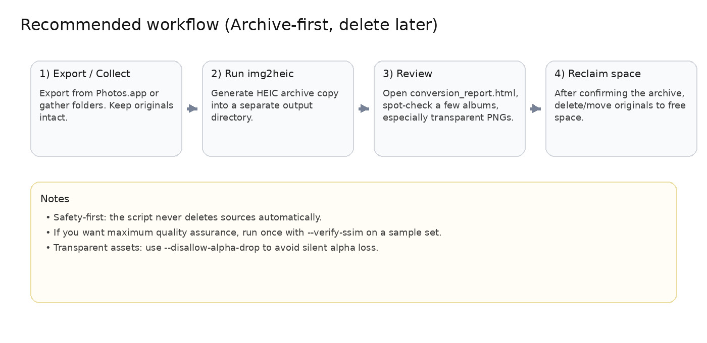
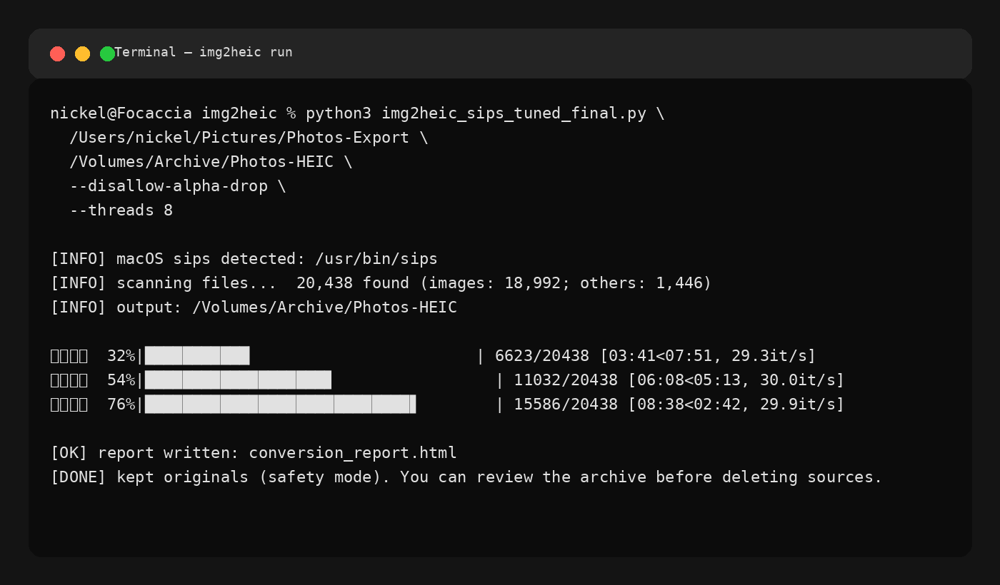
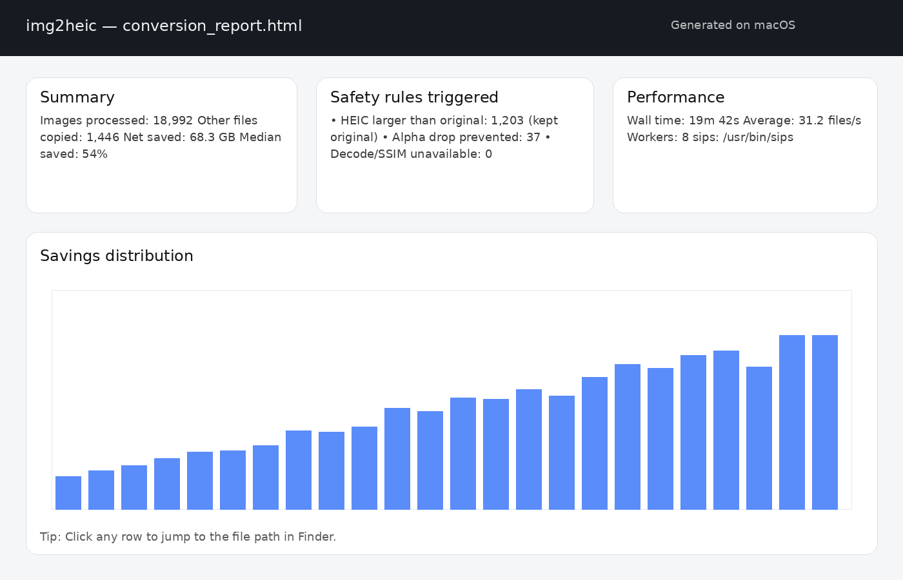

# img2heic (macOS) — HEIC Archive Script for Photo Cleanup

Batch-convert **PNG/JPEG → HEIC** on **macOS** using Apple’s built-in `sips`, producing an **archive-first** output folder that typically saves significant disk space.
The script is designed for **photo library cleanup**: generate a safe archive copy, review it, then delete/move originals only after you’re satisfied.

<p align="center">
  
</p>

---

## Highlights

- Recursive directory processing (keeps original folder structure)
- Converts **PNG/JPEG → HEIC** via **`sips`**
- Copies **non-image files** as-is (sidecars, JSON, notes, etc.)
- Tolerates **wrong file extensions** (detects by magic bytes)
- **Safety fallbacks**
  - If HEIC is larger → keep original
  - Optional strict alpha handling for transparent assets
- **Resume support**: restart safely after interruption
- Multi-process acceleration (`--threads`)
- Optional **SSIM verification** (`--verify-ssim`) with auto quality escalation
- Generates a **conversion report** (`conversion_report.html`)

---

## Screenshot

### Running the script



### Example report (screenshot)



You can also include a lightweight example report in your repository:

- `examples/conversion_report_example.html`

---

## Recommended workflow (Archive-first)

1. **Export / collect** photos into a folder (e.g., export albums from Photos.app or copy from external drives).
2. **Run `img2heic`** to produce an HEIC archive copy into a separate output directory.
3. **Review** the archive:
   - Open `conversion_report.html`
   - Spot-check a few albums (especially **transparent PNG** assets).
4. **Reclaim space**: delete/move originals only after confirmation.

> The script **never deletes source files** automatically.

---

## Requirements

- macOS (uses `/usr/bin/sips`)
- Python 3.9+ (recommended: 3.10/3.11)

Optional (only for `--verify-ssim`):
- `pillow-heif`
- `scikit-image`

```bash
pip install pillow-heif scikit-image
```

---

## Quick start

### 1) Basic usage (recommended)

```bash
python3 img2heic_sips_tuned_final.py "/path/to/SRC" "/path/to/OUT"
```

### 2) Let the script choose the default OUT folder

```bash
python3 img2heic_sips_tuned_final.py "/path/to/SRC"
# OUT defaults to: /path/to/SRC_archived
```

### 3) Strict transparent-asset safety

If you store lots of transparent PNG assets (icons, stickers, design exports):

```bash
python3 img2heic_sips_tuned_final.py SRC OUT --disallow-alpha-drop
```

### 4) Quality assurance with SSIM (slower, more robust)

```bash
python3 img2heic_sips_tuned_final.py SRC OUT \
  --disallow-alpha-drop \
  --verify-ssim \
  --ssim-threshold 0.97 \
  --quality-ladder 55,65,75,85,90
```

---

## Output layout

The output folder mirrors the input structure.

Typical files in the output directory:

- Converted `.heic` images (for PNG/JPEG inputs)
- Copied originals for anything skipped (unsupported, larger after conversion, alpha issues, etc.)
- `.conversion_progress.json` — resume state (do not delete unless you want a full re-run)
- `conversion_report.html` — summary + per-file stats

---

## Notes on transparency (alpha)

HEIC alpha support varies between apps and pipelines. If your workflow relies heavily on transparency:

- Use `--disallow-alpha-drop` to avoid silent alpha loss
- Keep critical transparent assets as PNG if needed (the script will fall back safely)

---

## Troubleshooting

### “sips not found”
`/usr/bin/sips` is built-in on macOS. If your environment can’t find it, verify:

```bash
which sips
# should print: /usr/bin/sips
```

### SSIM is always missing / “unavailable”
Install optional deps:

```bash
pip install pillow-heif scikit-image
```

---

## License

Use and modify freely for personal archiving and cleanup workflows.
(If you plan to publish it, consider adding an explicit license file such as MIT.)

---

## Repository structure (suggested)

```text
.
├── img2heic_sips_tuned_final.py
├── README.md
├── docs/
│   └── images/
│       ├── workflow.png
│       ├── terminal-run.png
│       └── report-example.png
└── examples/
    └── conversion_report_example.html
```
